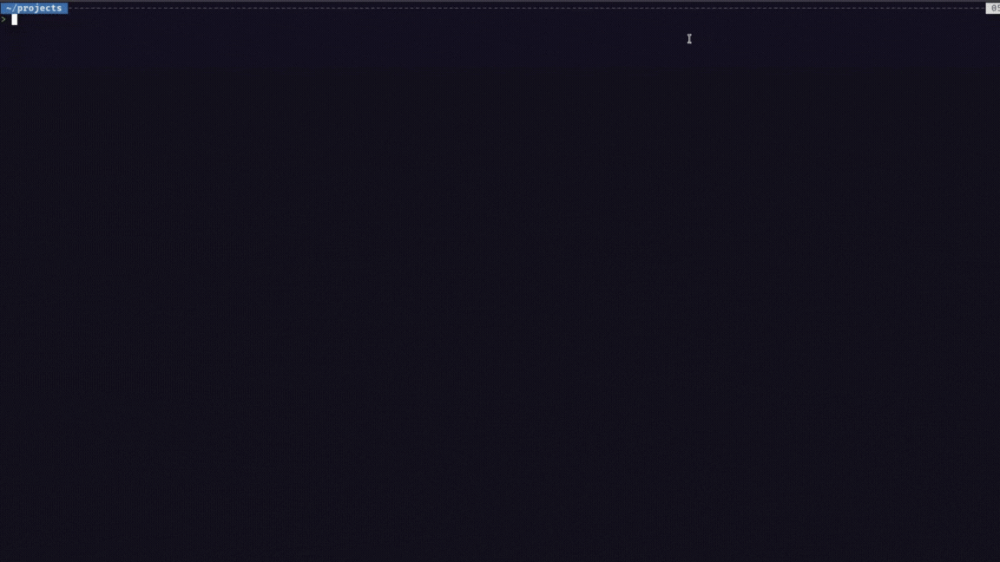
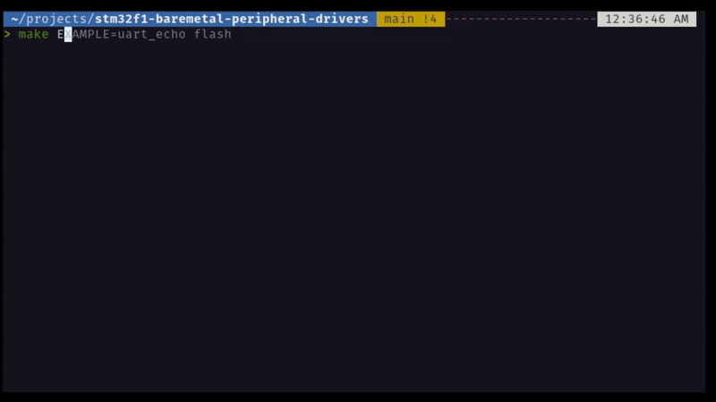

#  STM32F1 Bare-Metal Peripheral Drivers

### Overview 
This repository demonstrates **professional bare-metal firmware development** for the STM32F103 MCU using **CMSIS and custom drivers**.  
It emphasizes **deep MCU knowledge, memory-mapped registers, peripheral control, and full build workflow expertise** using a **Makefile-based pipeline**,` OpenOCD` , and `GDB`.  
Every peripheral driver is documented and demonstrated through **practical examples**, showcasing the ability to implement real-world functionality from datasheets.

---
## Core Drivers & Focus Areas
- **GPIO** – Input/output, toggling, memory-mapped structures, BSSR operations  
- **UART** – TX/RX, baud configuration, interrupt handling  
- **ADC** – Single and multi-channel conversions, polling & DMA (future)  
- **SysTick & Timers** – Delays, scheduling, output compare mode  
- **Memory Mapping** – Structured register access, safe abstraction  
- **I2C / SPI / DMA / Interrupts** – Advanced peripherals for real-time workflows (would be adding soon) 

 Each driver is **CMSIS-compatible** and built with clear **register-level understanding** and **custom abstraction**.  

---

### Workflow & Toolchain
- **Compiler:** `arm-none-eabi-gcc`  
- **Debugger:** `arm-none-eabi-gdb`  
- **Flashing:** OpenOCD  
- **Build System:** Custom `Makefile`  
- **Target Board:** NUCLEO-F103RB 

## Setup & Build
```bash
git clone https://github.com/R-onit/stm32f1-baremetal-peripheral-drivers

cd stm32f1-baremetal-peripheral-drivers
chmod +x setup_env.sh

./setup_env.sh
```
OR
```bash
sudo apt install gcc-arm-none-eabi binutils-arm-none-eabi gdb-multiarch -y
sudo apt install build-essential make git -y
sudo apt install openocd -y
```

## Build & Workflow

This repository uses a single Makefile to manage building, flashing, and debugging of all example projects. The Makefile handles compilation, linking, and generation of object files, ELF, and binary files for each example.
Build an example:
```bash
make <example_name>
```
Compiles the source files of the specified example, generates the build artifacts, and places them in the corresponding build/ folder
Example :
```
make 00_led_toggle-addr
```
Clean build artifacts (removes all generated object files, ELF, and binary files.)

```bash
make clean
```
OpenOCD server (Starts the OpenOCD GDB server for flashing and debugging the MCU.
)
```bash
make openocd
```

Open another terminal & Start GDB debugging session
```bash
make gdb
```

Flash firmware to the MCU (Compiles the current example (if not already built) and flashes the firmware onto the STM32F103 board using OpenOCD.)
```bash
make flash
```
Uses arm-none-eabi-objdump to produce a human-readable disassembly of the compiled objects. The output is written to dump.txt.
```bash
make dump
```
Check binary/object size (Uses arm-none-eabi-size to display text, data, and bss segment sizes of the compiled example.
Example output shows how much flash and RAM each example consumes.)
```bash
make size 
```



### Features:
- Single Makefile supports all examples, making compilation and flashing consistent.
- Automatically manages build directories, object files, and ELF/binary outputs.
- Enables seamless debugging with GDB + OpenOCD.
- Ensures reproducible and modular workflow for all peripheral examples.

This workflow demonstrates mastery of `bare-metal firmware pipelines`, `Makefile automation`, and `embedded build processes` — essential skills for professional embedded development.

## Key Features
- Deep register-level understanding of STM32F103 peripherals
- CMSIS-compatible drivers with clean abstractions
- Custom Makefile build workflow: compile, link, flash, debug
- Practical example projects showing driver functionality in action
- Professional documentation per peripheral explaining registers, setup, and usage

## Learning Outcomes
This repository demonstrates that the I can:

- Read datasheets and implement robust drivers from scratch
- Build bare-metal firmware using GCC + Make + OpenOCD/GDB
- Create structured, modular, and reusable code for multiple peripherals
- Understand Cortex-M architecture, memory-mapped registers, and timers
- could write drivers like `UART`,` TIMERS`,` GPIO`,` SysTick`,` ADC`,` MEMORY MAPPING`.` INTERRUPTS`,` I2C`,` SPI` 
## Author
**Ronit** --  Embedded systems engineer specializing in bare-metal development, peripheral drivers, and low-level MCU workflows.